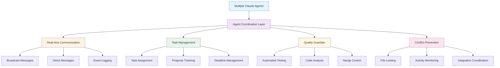
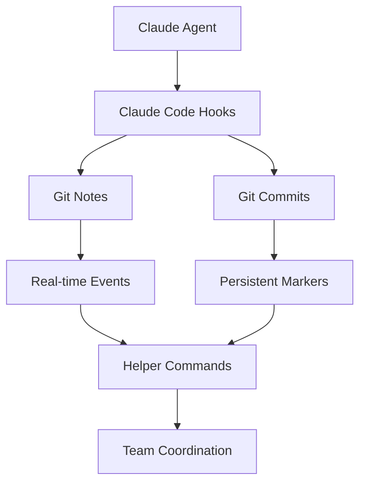

# 🤖 Agent Collaboration Management System

A sophisticated multi-agent coordination system for Claude Code agents working collaboratively on software projects with intelligent task management, automated testing, and seamless communication.

## 🌟 System Overview

Transform individual Claude Code agents into a coordinated, high-performing development team with:

- 🤝 **Real-time Multi-Agent Coordination** - Git-based communication and conflict prevention
- 📋 **Intelligent Task Management** - Assignment, deadlines, progress tracking with inter-agent visibility
- 🛡️ **Automated Quality Assurance** - Comprehensive testing guardian with merge control
- 💬 **Seamless Communication** - Broadcast messaging, direct messaging, and automatic event logging
- 🔧 **Multi-Language Support** - Node.js, Python, Go, Rust testing and analysis
- 🚀 **Production Ready** - Professional tooling for teams and enterprises

## ⚡ Quick Start

### **New Projects**
```bash
# Create collaborative repository with one command
/create-agent-collab-repo my-project node github-username
cd my-project
source .claude/agent-coordination-helpers.sh
```

### **Existing Projects**
```bash
# Add collaboration to existing repository
cd existing-project
/add-agent-collab-to-existing
source .claude/agent-coordination-helpers.sh
claude-agents-broadcast "Ready to collaborate!"
```

### **Activate Testing Guardian**
```bash
# Enable automated quality assurance
/agent-tester-guardian . strict false verbose
guardian-start
```

## 📊 **What This Enables**



---

## 🛠️ Core Components

### **1. 🤝 Multi-Agent Coordination**
- **Real-time Activity Tracking**: See what other agents are working on
- **File Conflict Prevention**: Automatic file locking and coordination
- **Session Management**: Agent availability and status tracking
- **Git-based Communication**: Reliable, persistent coordination through git infrastructure

### **2. 📋 Advanced Task Management**
- **Task Assignment with Deadlines**: Coordinate work schedules across agents
- **Progress Monitoring**: Real-time visibility into task completion
- **Dependency Tracking**: Coordinate task dependencies and handoffs
- **Integration with Claude Code**: Native task system integration

### **3. 🛡️ Intelligent Testing Guardian**
- **Comprehensive Multi-Language Testing**: Node.js, Python, Go, Rust support
- **Repository Relevance Validation**: Ensures changes align with project goals
- **Quality Scoring System**: Objective 0-100 quality assessment
- **Selective Merge Management**: Automated approve/reject with detailed feedback
- **Performance Analytics**: Test execution metrics and quality trends

### **4. 💬 Seamless Communication System**
- **Broadcast Messaging**: Team announcements and status updates
- **Direct Messaging**: Private agent-to-agent coordination
- **Automatic Event Logging**: Comprehensive activity history
- **Real-time Monitoring**: Live activity dashboards and alerts

---

## 📁 Repository Structure

```
agent-collab-management/
├── .claude/                              # Core coordination system
│   ├── skills/                           # Claude Code skills
│   │   ├── create-agent-collab-repo/     # New project creation
│   │   ├── add-agent-collab-to-existing/ # Existing project integration
│   │   └── agent-tester-guardian/        # Quality assurance system
│   ├── settings.json                     # Core coordination configuration
│   ├── agent-coordination-helpers.sh     # Bash/Zsh utility commands
│   ├── agent-coordination-helpers.fish   # Fish shell utility commands
│   └── COORDINATION.md                   # Detailed technical documentation
├── docs/                                 # Comprehensive documentation
│   ├── USER_GUIDE.md                     # Complete usage guide
│   ├── FULL_LIFECYCLE_DEMO.md            # End-to-end demo scenario
│   └── COMMUNICATION_ARCHITECTURE.md     # Communication system details
├── README.md                             # This file
└── .gitignore                           # Git ignore patterns
```

## 🎯 **Key Features**

| Feature | Description | Benefits |
|---------|-------------|----------|
| **🔄 Real-time Coordination** | Git-based event logging and communication | Zero conflicts, seamless collaboration |
| **📊 Task Management** | Assignment, deadlines, progress tracking | Organized workflow, clear accountability |
| **🧪 Automated Testing** | Comprehensive quality assurance guardian | Consistent quality, early issue detection |
| **💬 Team Communication** | Broadcast and direct messaging systems | Clear coordination, reduced miscommunication |
| **🔐 Conflict Prevention** | File locking and activity monitoring | Prevents merge conflicts and work duplication |
| **📈 Quality Analytics** | Code quality scoring and trend analysis | Continuous improvement, objective assessment |
| **🌐 Multi-Language** | Node.js, Python, Go, Rust support | Flexible development environments |
| **🐚 Cross-Shell** | Bash, Zsh, Fish compatibility | Works in any development setup |

---

## 🎬 **See It In Action**

### **📖 Complete Documentation**
- **[User Guide](docs/USER_GUIDE.md)** - Comprehensive usage instructions, commands, and best practices
- **[Full Lifecycle Demo](docs/FULL_LIFECYCLE_DEMO.md)** - End-to-end scenario showing complete development workflow
- **[Communication Architecture](docs/COMMUNICATION_ARCHITECTURE.md)** - Deep dive into agent communication systems

### **🚀 Quick Demo Scenario**

**Scenario**: Three agents building a Node.js API

1. **Alice** creates project: `/create-agent-collab-repo user-api node`
2. **Bob** joins: `/add-agent-collab-to-existing`
3. **Guardian** activates: `/agent-tester-guardian . strict false verbose`

**Real-time Coordination**:
```bash
# Alice starts work
claude-agents-broadcast "Starting authentication module"
claude-agents-assign task-001 "2026-05-07T17:00:00Z"

# Bob coordinates
claude-agents-assign task-002 "2026-05-06T18:00:00Z"
claude-agents-dm alice "I'll handle database while you do auth"

# Guardian monitors quality
🛡️ Guardian: Commit a1b2c3d4 analysis complete - APPROVE (92/100)
📢 Broadcast: ✅ Guardian: Auto-approved a1b2c3d4 for merge
```

**Result**: Zero conflicts, high quality code, seamless collaboration! 🎉

---

## 🛠️ Installation Methods

### **Method 1: Skills-Based Installation (Recommended)**

```bash
# Install via Claude Code skills (one-time setup)
# Skills are automatically available after installation

# For new projects:
/create-agent-collab-repo project-name project-type

# For existing projects:
/add-agent-collab-to-existing

# For testing automation:
/agent-tester-guardian
```

### **Method 2: Direct Integration**

```bash
# Clone and copy coordination files
git clone https://github.com/your-org/agent-collab-management.git
cp -r agent-collab-management/.claude ./

# Activate coordination
source .claude/agent-coordination-helpers.sh
```

### **Method 3: Submodule (For Teams)**

```bash
# Add as git submodule
git submodule add https://github.com/your-org/agent-collab-management.git .agent-collab
ln -sf .agent-collab/.claude ./

# Team members initialize
git submodule update --init --recursive
source .claude/agent-coordination-helpers.sh
```

---

## 🎓 **Learning Path**

### **🚀 Getting Started (5 minutes)**
1. Read [Quick Start](#-quick-start) section above
2. Try creating a test project with `/create-agent-collab-repo`
3. Explore basic commands: `claude-agents-status`, `claude-agents-log`

### **📚 Understanding the System (15 minutes)**
1. Review [User Guide](docs/USER_GUIDE.md) - comprehensive command reference
2. Understand communication via [Communication Architecture](docs/COMMUNICATION_ARCHITECTURE.md)
3. Learn task coordination and quality assurance features

### **🎬 See Real Usage (30 minutes)**
1. Follow [Full Lifecycle Demo](docs/FULL_LIFECYCLE_DEMO.md) - complete scenario
2. Practice agent communication and task coordination
3. Experience guardian quality control in action

### **🔧 Advanced Usage (Ongoing)**
1. Customize settings for your team's workflow
2. Integrate with CI/CD pipelines and external tools
3. Develop custom skills and extensions

---

## 🤝 **Team Setup & Collaboration**

### **For Team Leaders**

```bash
# 1. Set up coordination foundation
/create-agent-collab-repo team-project project-type github-org

# 2. Configure testing standards
/agent-tester-guardian . strict false verbose
guardian-start

# 3. Create team workflow
claude-agents-broadcast "Team coordination active! Please review tasks and assign yourselves."

# 4. Establish communication protocols
echo "Team Protocols:
- Broadcast work status updates
- Use direct messages for specific coordination
- Respond to guardian feedback promptly
- Check agent status before major changes" > TEAM_PROTOCOLS.md
```

### **For Team Members**

```bash
# 1. Join existing project
git clone team-project-repo
cd team-project
/add-agent-collab-to-existing

# 2. Introduce yourself
source .claude/agent-coordination-helpers.sh
claude-agents-broadcast "Agent [your-name] joining! Ready to collaborate."

# 3. Get oriented
claude-agents-status        # See team and tasks
claude-agents-analyze       # Understand project
claude-agents-tasks         # View available work

# 4. Start contributing
claude-agents-assign task-xxx "2026-05-10T17:00:00Z"
claude-agents-broadcast "Starting work on [task description]"
```

---

## 🌐 **Production Features**

### **🏢 Enterprise Ready**
- **Security**: Git-based coordination with standard authentication
- **Scalability**: Supports teams of any size with efficient coordination
- **Compliance**: Complete audit trails and activity logging
- **Integration**: Works with existing DevOps and CI/CD pipelines

### **📊 Analytics & Insights**
- **Team Productivity**: Agent contribution metrics and patterns
- **Quality Trends**: Code quality evolution over time
- **Coordination Effectiveness**: Communication and conflict metrics
- **Performance Monitoring**: Testing execution and approval rates

### **🔧 Customization**
- **Flexible Configuration**: Adapt to any team workflow
- **Custom Skills**: Extend with organization-specific automation
- **Integration Hooks**: Connect with external tools and services
- **Multi-Repository**: Coordinate across multiple projects

---

## 📈 **Success Metrics**

Teams using the Agent Collaboration System typically see:

- **🚫 Zero Merge Conflicts** - Proactive coordination prevents conflicts
- **📈 Higher Code Quality** - Guardian ensures consistent standards
- **⚡ Faster Development** - Reduced coordination overhead
- **🤝 Better Team Dynamics** - Clear communication and accountability
- **🛡️ Reduced Bugs** - Comprehensive automated testing catches issues early

---

## 🔗 **Related Resources**

- **[Skills Documentation](.claude/skills/README.md)** - Complete skills reference
- **[Coordination System](.claude/COORDINATION.md)** - Technical coordination details
- **[Claude Code Documentation](https://docs.claude.ai/claude-code)** - Official Claude Code docs
- **[Git Hooks Guide](https://git-scm.com/book/en/v2/Customizing-Git-Git-Hooks)** - Understanding git automation

---

## 🚀 **Get Started Now**

```bash
# Create your first collaborative project
/create-agent-collab-repo my-awesome-project node

# Or add collaboration to existing project
cd existing-project
/add-agent-collab-to-existing

# Start collaborating!
source .claude/agent-coordination-helpers.sh
claude-agents-status
```

**Transform your development workflow with intelligent agent collaboration!** 🎉

---

## 📜 **License**

MIT License - Use this system in your projects, contribute improvements, and help build the future of AI-assisted collaborative development!

## 🤝 **Contributing**

We welcome contributions! Whether it's new features, bug fixes, documentation improvements, or additional language support for the testing guardian.

**Areas for contribution:**
- Additional programming language support
- Enhanced communication features
- Advanced analytics and reporting
- Integration with more external tools
- Performance optimizations

---

**Happy collaborative coding! 🤖✨**

*Built with ❤️ for the Claude Code community*
├── .claude/
│   ├── settings.json                    # Core coordination configuration
│   ├── agent-coordination-helpers.sh    # Bash/Zsh utility commands
│   ├── agent-coordination-helpers.fish  # Fish shell utility commands
│   ├── agent-coordination-universal.sh  # Universal shell detector
│   └── COORDINATION.md                  # Detailed documentation
├── README.md                           # This file
├── .gitignore                          # Git ignore patterns
└── DEMO.md                            # Simple demonstration
```

## 🐚 Shell Support

The coordination system supports multiple shells:

- **Bash** - Use `agent-coordination-helpers.sh`
- **Zsh** - Use `agent-coordination-helpers.sh` (compatible)
- **Fish** - Use `agent-coordination-helpers.fish`
- **Universal** - Use `agent-coordination-universal.sh` (auto-detects)

## 🔧 Core Features

### Automatic Event Tracking
- **Session Events**: Agent starts/stops working
- **Git Operations**: Commits, pushes, merges, branch creation
- **Task Management**: Task creation and completion
- **File Operations**: File modification tracking

### Coordination Commands
- `claude-agents-log` - Recent agent activity
- `claude-agents-active` - Currently active agents
- `claude-agents-today` - Today's activity
- `claude-agents-search <keyword>` - Search events
- `claude-agents-stats` - Usage statistics

### Git-Based Communication
- Uses git notes for real-time event logging
- Structured commit messages for persistent coordination
- Branch-aware coordination
- Shareable across team repositories

## 🏗️ Architecture

The system uses Claude Code's hook system to automatically log coordination events:



## 📚 Documentation

- **[COORDINATION.md](.claude/COORDINATION.md)** - Complete system documentation
- **[settings.json](.claude/settings.json)** - Configuration reference
- **[Helper Functions](.claude/agent-coordination-helpers.sh)** - Command reference

## 🔧 Installation in Existing Projects

### Option 1: Direct Integration
```bash
# Copy configuration files
cp -r /path/to/agent-collab-management/.claude ./

# Add to your .gitignore (optional)
echo ".claude/settings.local.json" >> .gitignore
```

### Option 2: Submodule (Recommended for teams)
```bash
# Add as submodule
git submodule add <this-repo-url> .agent-collab

# Link configuration
ln -sf .agent-collab/.claude ./

# Source helpers in your shell profile
echo "source ~/.agent-collab/.claude/agent-coordination-helpers.sh" >> ~/.bashrc
```

## 🤝 Team Setup

1. **Commit the configuration**: The `.claude/settings.json` should be committed and shared
2. **Share coordination data**: Use `git push/pull refs/notes/agent-coordination`
3. **Establish conventions**: Agree on branch naming and coordination patterns
4. **Train your team**: Everyone should source the helper functions

## 🌐 Public Repository

This repository is designed to be:
- **Public and shareable** - Safe for open source projects
- **Professional** - Clean, documented, and maintainable
- **Reusable** - Easy to integrate into any project
- **Extensible** - Customizable for specific team needs

## 📖 Usage Examples

### Basic Coordination Flow
```bash
# Agent 1 starts work
SESSION_START | agent: claude-alice-laptop | timestamp: 2026-04-20T10:30:00

# Agent 1 creates task and modifies files
TASK_CREATED | agent: claude-alice-laptop | task: implement authentication
FILE_MODIFY_START | agent: claude-alice-laptop | file: src/auth.js

# Agent 2 joins and checks activity
$ claude-agents-active
👥 Active Agents (last 24 hours):
   agent: claude-alice-laptop
   agent: claude-bob-server

# Agent 1 commits changes
COMMIT_COMPLETE | agent: claude-alice-laptop | hash: abc123 | branch: feature-auth
```

### Searching for Specific Activity
```bash
$ claude-agents-search "auth"
🔍 Searching agent events for: 'auth'
   TASK_CREATED | agent: claude-alice-laptop | task: implement authentication
   FILE_MODIFY_START | agent: claude-alice-laptop | file: src/auth.js
```

## 🛠️ Configuration

The system is configured via `.claude/settings.json` with:
- **Permissions**: Secure tool access controls
- **Hooks**: Event-driven coordination triggers
- **Environment**: Agent identification settings

## 📊 Analytics and Insights

The coordination system provides insights into:
- Team productivity patterns
- Code conflict avoidance
- Task completion rates
- Collaboration effectiveness

## 🤖 Supported Claude Code Events

- SessionStart/Stop
- PreToolUse/PostToolUse
- TaskCreated/TaskCompleted
- Git operations (commit, push, merge, branch)
- File modifications (Write/Edit)

## 🎯 Use Cases

- **Team Development**: Multiple developers with Claude agents
- **Code Reviews**: Track agent-assisted review activities
- **DevOps**: Coordinate deployment and maintenance tasks
- **Open Source**: Enable community agent collaboration
- **Education**: Track learning and development progress

## 🔗 Related

- **[agent-collab-demo](../agent-collab-demo)** - Working demonstration repository
- **[Claude Code Documentation](https://docs.claude.ai/claude-code)** - Official Claude Code docs

## 📜 License

MIT License - Feel free to use in your projects!

## 🤝 Contributing

Contributions welcome! Please see our coordination guidelines and test your changes with the demo repository.

---

**Happy collaborative coding! 🎉**

For support, create an issue or check out the demo repository for working examples.