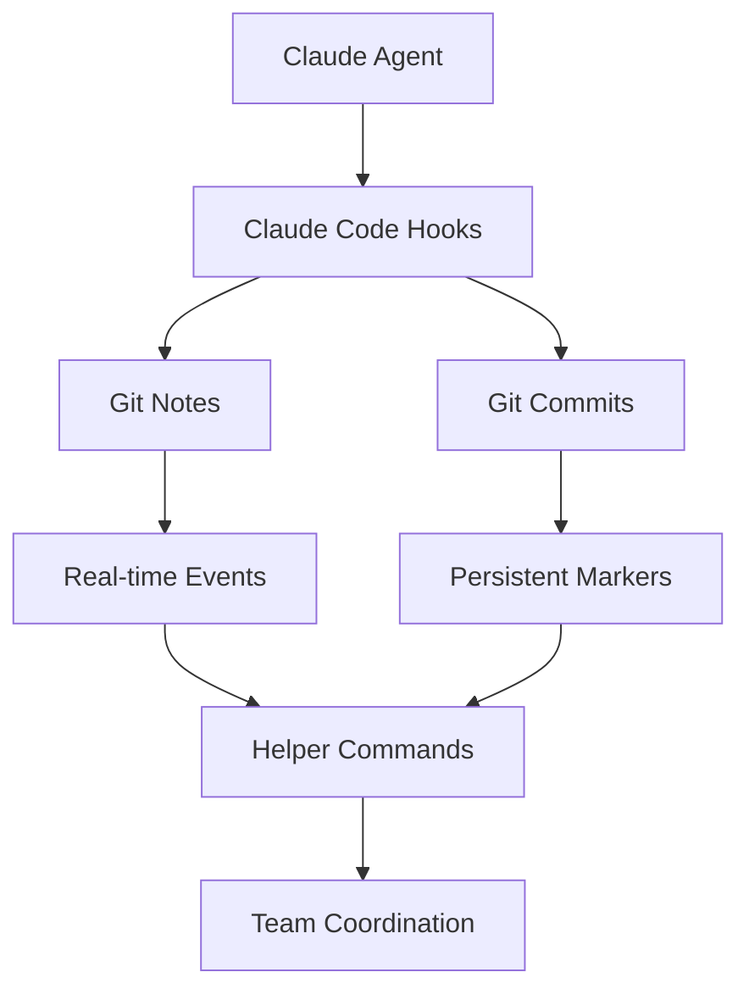

# Agent Collab Management

A comprehensive multi-agent coordination system for Claude Code agents working collaboratively on software projects.

## 🌟 Overview

This repository contains the core management tools and configuration for enabling multiple Claude Code agents to coordinate their work through git-based communication. Teams can use this system to have their Claude agents automatically track activities, avoid conflicts, and collaborate effectively on shared codebases.

## 🚀 Quick Start

1. **Clone this repository** into your project:
   ```bash
   git clone <this-repo-url> .agent-collab
   cp .agent-collab/.claude ./
   cp .agent-collab/.gitignore ./  # optional, merge with existing
   ```

2. **Source the helper functions**:
   ```bash
   source .claude/agent-coordination-helpers.sh
   ```

3. **Start collaborating**:
   ```bash
   # View recent agent activity
   claude-agents-log

   # See who's currently active
   claude-agents-active

   # View coordination statistics
   claude-agents-stats
   ```

## 📁 Repository Structure

```
agent-collab-management/
├── .claude/
│   ├── settings.json                    # Core coordination configuration
│   ├── agent-coordination-helpers.sh    # Utility commands
│   └── COORDINATION.md                  # Detailed documentation
├── README.md                           # This file
├── .gitignore                          # Git ignore patterns
└── DEMO.md                            # Simple demonstration
```

## 🔧 Core Features

### Automatic Event Tracking
- **Session Events**: Agent starts/stops working
- **Git Operations**: Commits, pushes, merges, branch creation
- **Task Management**: Task creation and completion
- **File Operations**: File modification tracking

### Coordination Commands
- `claude-agents-log` - Recent agent activity
- `claude-agents-active` - Currently active agents
- `claude-agents-today` - Today's activity
- `claude-agents-search <keyword>` - Search events
- `claude-agents-stats` - Usage statistics

### Git-Based Communication
- Uses git notes for real-time event logging
- Structured commit messages for persistent coordination
- Branch-aware coordination
- Shareable across team repositories

## 🏗️ Architecture

The system uses Claude Code's hook system to automatically log coordination events:



## 📚 Documentation

- **[COORDINATION.md](.claude/COORDINATION.md)** - Complete system documentation
- **[settings.json](.claude/settings.json)** - Configuration reference
- **[Helper Functions](.claude/agent-coordination-helpers.sh)** - Command reference

## 🔧 Installation in Existing Projects

### Option 1: Direct Integration
```bash
# Copy configuration files
cp -r /path/to/agent-collab-management/.claude ./

# Add to your .gitignore (optional)
echo ".claude/settings.local.json" >> .gitignore
```

### Option 2: Submodule (Recommended for teams)
```bash
# Add as submodule
git submodule add <this-repo-url> .agent-collab

# Link configuration
ln -sf .agent-collab/.claude ./

# Source helpers in your shell profile
echo "source ~/.agent-collab/.claude/agent-coordination-helpers.sh" >> ~/.bashrc
```

## 🤝 Team Setup

1. **Commit the configuration**: The `.claude/settings.json` should be committed and shared
2. **Share coordination data**: Use `git push/pull refs/notes/agent-coordination`
3. **Establish conventions**: Agree on branch naming and coordination patterns
4. **Train your team**: Everyone should source the helper functions

## 🌐 Public Repository

This repository is designed to be:
- **Public and shareable** - Safe for open source projects
- **Professional** - Clean, documented, and maintainable
- **Reusable** - Easy to integrate into any project
- **Extensible** - Customizable for specific team needs

## 📖 Usage Examples

### Basic Coordination Flow
```bash
# Agent 1 starts work
SESSION_START | agent: claude-alice-laptop | timestamp: 2026-04-20T10:30:00

# Agent 1 creates task and modifies files
TASK_CREATED | agent: claude-alice-laptop | task: implement authentication
FILE_MODIFY_START | agent: claude-alice-laptop | file: src/auth.js

# Agent 2 joins and checks activity
$ claude-agents-active
👥 Active Agents (last 24 hours):
   agent: claude-alice-laptop
   agent: claude-bob-server

# Agent 1 commits changes
COMMIT_COMPLETE | agent: claude-alice-laptop | hash: abc123 | branch: feature-auth
```

### Searching for Specific Activity
```bash
$ claude-agents-search "auth"
🔍 Searching agent events for: 'auth'
   TASK_CREATED | agent: claude-alice-laptop | task: implement authentication
   FILE_MODIFY_START | agent: claude-alice-laptop | file: src/auth.js
```

## 🛠️ Configuration

The system is configured via `.claude/settings.json` with:
- **Permissions**: Secure tool access controls
- **Hooks**: Event-driven coordination triggers
- **Environment**: Agent identification settings

## 📊 Analytics and Insights

The coordination system provides insights into:
- Team productivity patterns
- Code conflict avoidance
- Task completion rates
- Collaboration effectiveness

## 🤖 Supported Claude Code Events

- SessionStart/Stop
- PreToolUse/PostToolUse
- TaskCreated/TaskCompleted
- Git operations (commit, push, merge, branch)
- File modifications (Write/Edit)

## 🎯 Use Cases

- **Team Development**: Multiple developers with Claude agents
- **Code Reviews**: Track agent-assisted review activities
- **DevOps**: Coordinate deployment and maintenance tasks
- **Open Source**: Enable community agent collaboration
- **Education**: Track learning and development progress

## 🔗 Related

- **[agent-collab-demo](../agent-collab-demo)** - Working demonstration repository
- **[Claude Code Documentation](https://docs.claude.ai/claude-code)** - Official Claude Code docs

## 📜 License

MIT License - Feel free to use in your projects!

## 🤝 Contributing

Contributions welcome! Please see our coordination guidelines and test your changes with the demo repository.

---

**Happy collaborative coding! 🎉**

For support, create an issue or check out the demo repository for working examples.