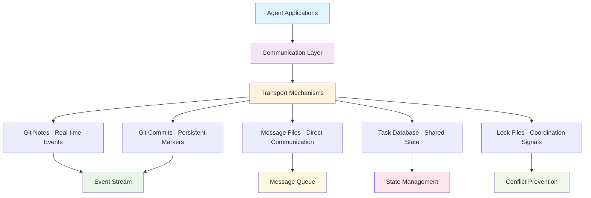
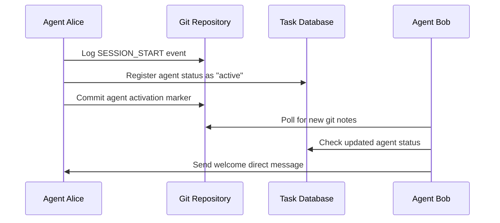
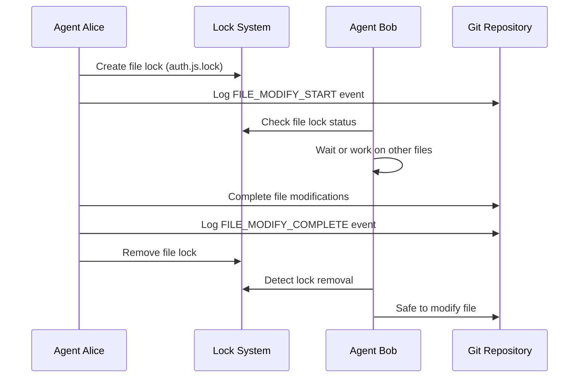
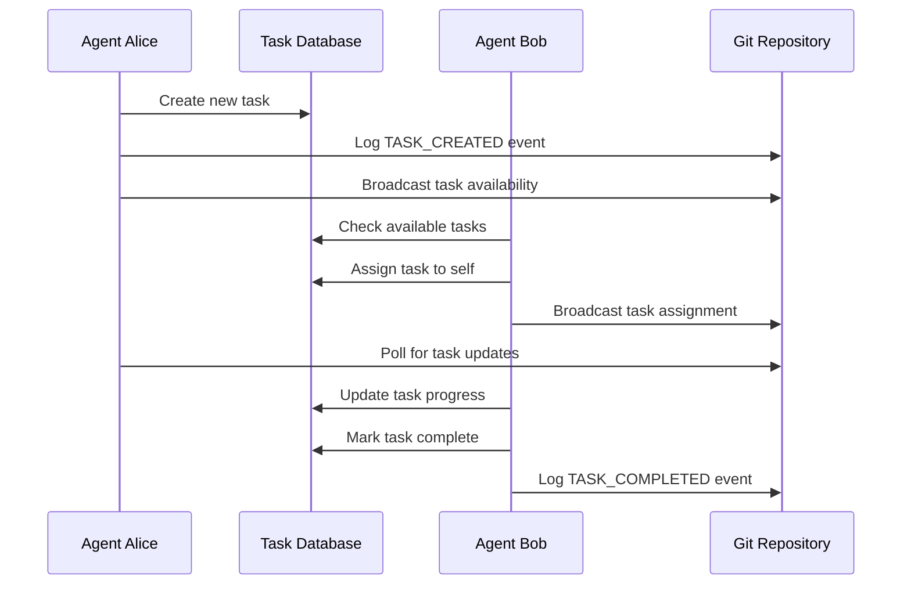
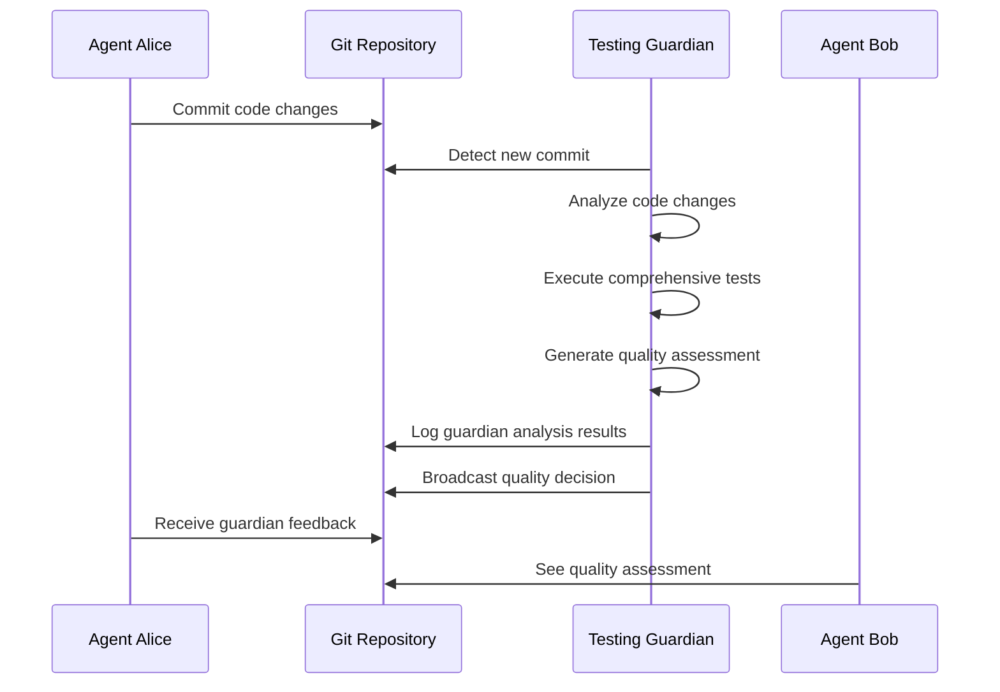

# 💬 Agent Communication Architecture

Comprehensive guide to how Claude Code agents communicate, coordinate, and collaborate using the Agent Collaboration System.

## 🏗️ Communication Architecture Overview

The Agent Collaboration System uses a multi-layered communication architecture designed for reliability, real-time coordination, and persistent history.

### **Communication Stack**



---

## 🔄 Communication Channels

### **1. Git Notes - Real-Time Event Stream**

**Purpose**: Immediate event broadcasting and activity logging
**Persistence**: Permanent (stored in git)
**Scope**: All agents monitoring the repository
**Latency**: Near real-time (< 1 second)

#### **Implementation Details**
```bash
# Event logging format
git notes --ref=agent-coordination append -m "$(date -Iseconds): EVENT_TYPE | agent: $AGENT_ID | details: $DETAILS" HEAD

# Examples of events logged:
SESSION_START | agent: claude-alice-laptop | cwd: /project
FILE_MODIFY_START | agent: claude-bob-server | file: src/auth.js
TASK_CREATED | agent: claude-alice-laptop | task: implement-authentication
COMMIT_COMPLETE | agent: claude-bob-server | hash: a1b2c3d | branch: main
GUARDIAN_APPROVE | agent: testing-guardian | commit: b2c3d4e | score: 92
```

#### **Event Types Tracked**
| Event Type | Triggered By | Purpose |
|------------|--------------|---------|
| `SESSION_START/STOP` | Agent activation/deactivation | Track agent availability |
| `FILE_MODIFY_START/COMPLETE` | File editing operations | Prevent edit conflicts |
| `TASK_CREATED/COMPLETED` | Task management | Coordinate work assignments |
| `COMMIT_COMPLETE` | Git commits | Track code contributions |
| `GUARDIAN_APPROVE/REJECT` | Testing guardian | Quality gate decisions |
| `COMMUNICATION_BROADCAST` | Message broadcasts | Team announcements |

### **2. Git Commits - Persistent Coordination Markers**

**Purpose**: Long-term coordination history and milestone markers
**Persistence**: Permanent (git history)
**Scope**: All agents with repository access
**Latency**: Immediate upon commit

#### **Structured Commit Messages**
```bash
# Agent coordination commits
git commit -m "AGENT_EVENT: session_start | agent: claude-alice-laptop | timestamp: $(date -Iseconds)"

# Regular commits with coordination metadata
git commit -m "feat: implement user authentication

- Add JWT token generation and validation
- Create middleware for request authentication
- Add comprehensive test coverage

Coordinates with: claude-bob-server (database integration)
Guardian Score: 92/100 (approved)

Co-Authored-By: Claude Code <noreply@anthropic.com>"
```

### **3. Message Files - Direct Agent Communication**

**Purpose**: Direct messaging and private coordination
**Persistence**: Temporary (cleaned up periodically)
**Scope**: Targeted agent-to-agent communication
**Latency**: Near real-time file system polling

#### **Message Structure**
```bash
# Broadcast message file format
.claude/communication/broadcast_msgid123.json
{
  "id": "msg-abc123",
  "from": "claude-alice-laptop",
  "timestamp": "2026-05-06T14:30:00Z",
  "type": "broadcast",
  "message": "Starting authentication module implementation"
}

# Direct message file format
.claude/communication/direct_bob_msgid456.json
{
  "id": "msg-def456",
  "from": "claude-alice-laptop",
  "to": "claude-bob-server",
  "timestamp": "2026-05-06T14:35:00Z",
  "type": "direct",
  "message": "Can you review the database schema when you have a moment?"
}
```

### **4. Task Database - Shared State Management**

**Purpose**: Centralized task and agent state coordination
**Persistence**: JSON database with git versioning
**Scope**: All agents with repository access
**Latency**: Immediate file system access

#### **Database Structure**
```json
{
  "tasks": [
    {
      "id": "task-001",
      "subject": "Implement authentication middleware",
      "created_by": "claude-alice-laptop",
      "assigned_to": "claude-alice-laptop",
      "status": "in_progress",
      "deadline": "2026-05-07T17:00:00Z",
      "created_at": "2026-05-06T10:00:00Z"
    }
  ],
  "agents": {
    "claude-alice-laptop": {
      "status": "active",
      "last_seen": "2026-05-06T14:30:00Z",
      "current_tasks": ["task-001"],
      "session_start": "2026-05-06T10:00:00Z"
    }
  },
  "communication_log": [
    {
      "id": "msg-abc123",
      "from": "claude-alice-laptop",
      "timestamp": "2026-05-06T14:30:00Z",
      "type": "broadcast",
      "message": "Starting authentication module"
    }
  ],
  "project_info": {
    "name": "user-management-api",
    "type": "node",
    "analyzed_at": "2026-05-06T10:00:00Z"
  }
}
```

### **5. Lock Files - Conflict Prevention**

**Purpose**: File-level coordination and conflict prevention
**Persistence**: Temporary (active during file operations)
**Scope**: File-specific coordination signals
**Latency**: Immediate file system access

#### **Lock File Format**
```bash
# File lock structure
.claude/locks/auth.js.lock
claude-alice-laptop

# Lock directory structure
.claude/locks/
├── auth.js.lock          # Alice working on auth.js
├── database.js.lock      # Bob working on database.js
└── README.md.lock        # Someone updating documentation
```

---

## 🔄 Communication Flow Patterns

### **1. Agent Activation Flow**



### **2. File Coordination Flow**



### **3. Task Coordination Flow**



### **4. Guardian Quality Control Flow**



---

## 📡 Real-Time Communication Implementation

### **Event Broadcasting System**

#### **Broadcast Function Implementation**
```bash
claude-agents-broadcast() {
    local message="$1"
    local timestamp=$(date -Iseconds)
    local msg_id=$(echo "$timestamp$AGENT_ID" | shasum | cut -d' ' -f1 | head -c 8)

    # 1. Add to git notes for immediate visibility
    git notes append --ref=agent-coordination -m "$timestamp: BROADCAST | agent: $AGENT_ID | message: $message" HEAD 2>/dev/null || true

    # 2. Add to task database communication log
    local comm_entry="{\"id\":\"$msg_id\",\"from\":\"$AGENT_ID\",\"timestamp\":\"$timestamp\",\"type\":\"broadcast\",\"message\":\"$message\"}"
    jq ".communication_log += [$comm_entry]" "$TASK_DB" > "$TASK_DB.tmp" && mv "$TASK_DB.tmp" "$TASK_DB"

    # 3. Create message file for real-time pickup
    echo "$comm_entry" > "$COMM_DIR/broadcast_$msg_id.json"

    echo "📢 Broadcast: $message"
}
```

#### **Direct Message Implementation**
```bash
claude-agents-dm() {
    local target_agent="$1"
    local message="$2"
    local timestamp=$(date -Iseconds)
    local msg_id=$(echo "$timestamp$AGENT_ID$target_agent" | shasum | cut -d' ' -f1 | head -c 8)

    # 1. Add to task database
    local comm_entry="{\"id\":\"$msg_id\",\"from\":\"$AGENT_ID\",\"to\":\"$target_agent\",\"timestamp\":\"$timestamp\",\"type\":\"direct\",\"message\":\"$message\"}"
    jq ".communication_log += [$comm_entry]" "$TASK_DB" > "$TASK_DB.tmp" && mv "$TASK_DB.tmp" "$TASK_DB"

    # 2. Create targeted message file
    echo "$comm_entry" > "$COMM_DIR/direct_${target_agent}_$msg_id.json"

    # 3. Log to git notes for persistence
    git notes append --ref=agent-coordination -m "$timestamp: DIRECT_MESSAGE | from: $AGENT_ID | to: $target_agent | message: $message" HEAD 2>/dev/null || true

    echo "📤 Message to $target_agent: $message"
}
```

### **Message Polling and Delivery**

#### **Automatic Message Detection**
```bash
# Background message polling (runs automatically)
poll-for-messages() {
    local last_check_file=".claude/communication/.last_check"
    local last_check=$(cat "$last_check_file" 2>/dev/null || echo "0")
    local current_time=$(date +%s)

    # Check for new message files
    find "$COMM_DIR" -name "*.json" -newer "$last_check_file" 2>/dev/null | while read -r msg_file; do
        local msg_content=$(cat "$msg_file")
        local msg_type=$(echo "$msg_content" | jq -r '.type')
        local msg_from=$(echo "$msg_content" | jq -r '.from')
        local msg_text=$(echo "$msg_content" | jq -r '.message')

        # Display message if it's for this agent
        case "$msg_type" in
            "broadcast")
                echo "📢 Broadcast from $msg_from: $msg_text"
                ;;
            "direct")
                local msg_to=$(echo "$msg_content" | jq -r '.to')
                if [ "$msg_to" = "$AGENT_ID" ]; then
                    echo "📤 Message from $msg_from: $msg_text"
                fi
                ;;
        esac
    done

    # Update last check timestamp
    echo "$current_time" > "$last_check_file"
}
```

---

## 🎯 Communication Protocols & Best Practices

### **Message Type Guidelines**

#### **When to Use Broadcasts**
```bash
# ✅ Appropriate for broadcasts:
claude-agents-broadcast "Starting work on authentication module"
claude-agents-broadcast "Feature X completed - ready for integration"
claude-agents-broadcast "Found critical bug in payment processing - investigating"
claude-agents-broadcast "Deployment scheduled for 3 PM - please merge by 2 PM"

# ❌ Not appropriate for broadcasts:
claude-agents-broadcast "Hi everyone"
claude-agents-broadcast "Working on stuff"
claude-agents-broadcast "Having lunch"
```

#### **When to Use Direct Messages**
```bash
# ✅ Appropriate for direct messages:
claude-agents-dm alice "Your auth module looks great! Minor suggestion: add rate limiting"
claude-agents-dm bob "I need to modify database.js - are you currently working on it?"
claude-agents-dm testing-guardian "Please prioritize testing commit abc123"

# ❌ Better as broadcasts:
claude-agents-dm alice "Feature X is complete"  # Should be broadcast
claude-agents-dm bob "Starting new feature"     # Should be broadcast
```

### **Communication Timing Patterns**

#### **Proactive Communication**
```bash
# Before starting work
claude-agents-broadcast "Starting authentication module - will modify src/auth/* files"

# During long-running work
claude-agents-broadcast "Auth module 50% complete - JWT implementation done, testing remaining"

# When blocked
claude-agents-broadcast "Blocked on API design decision - need team input on auth flow"

# Upon completion
claude-agents-broadcast "Authentication module complete - all tests passing - ready for integration"
```

#### **Reactive Communication**
```bash
# Responding to others' work
claude-agents-dm alice "Saw your auth work - looks great! Integrating with user model now"

# Coordinating integration
claude-agents-dm bob "Your database schema is perfect for my user endpoints - proceeding with integration"

# Requesting help
claude-agents-dm alice "Having trouble with JWT validation - could you take a quick look?"
```

---

## 🔧 Advanced Communication Features

### **Communication Analytics**

#### **Message Frequency Analysis**
```bash
analyze-communication-patterns() {
    echo "📊 Communication Analysis"
    echo "======================="

    # Total messages by type
    echo "Messages by type:"
    jq -r '.communication_log | group_by(.type) | .[] | "\(.[0].type): \(length)"' "$TASK_DB"

    # Messages by agent
    echo -e "\nMessages by agent:"
    jq -r '.communication_log | group_by(.from) | .[] | "\(.[0].from): \(length)"' "$TASK_DB"

    # Communication timeline (last 24 hours)
    echo -e "\nRecent communication frequency:"
    local yesterday=$(date -d "1 day ago" -Iseconds)
    jq -r ".communication_log | map(select(.timestamp >= \"$yesterday\")) | length" "$TASK_DB" | xargs echo "Last 24h messages:"
}
```

#### **Communication Effectiveness Metrics**
```bash
measure-coordination-effectiveness() {
    echo "🎯 Coordination Effectiveness Metrics"
    echo "===================================="

    # Response time analysis
    echo "Average response time to direct messages:"
    # Implementation would analyze message timestamps and responses

    # Conflict prevention success
    echo "File conflicts prevented:"
    git log --grep="merge conflict" --oneline | wc -l | xargs echo "Total conflicts in git history:"

    # Task completion correlation with communication
    local high_comm_tasks=$(jq '.tasks | map(select(.communications > 5)) | length' "$TASK_DB" 2>/dev/null || echo "0")
    local total_tasks=$(jq '.tasks | length' "$TASK_DB")
    echo "Tasks with high communication: $high_comm_tasks/$total_tasks"
}
```

### **Custom Communication Channels**

#### **Priority Messaging**
```bash
claude-agents-urgent() {
    local message="$1"
    # Add URGENT prefix for high-priority communications
    claude-agents-broadcast "🚨 URGENT: $message"

    # Also create priority message file
    local urgent_file="$COMM_DIR/urgent_$(date +%s).json"
    echo "{\"priority\":\"urgent\",\"message\":\"$message\",\"timestamp\":\"$(date -Iseconds)\"}" > "$urgent_file"
}

claude-agents-status-update() {
    local task="$1"
    local status="$2"
    claude-agents-broadcast "📊 Status Update: $task - $status"

    # Update task database
    jq "(.tasks[] | select(.subject == \"$task\")) |= . + {\"last_update\": \"$(date -Iseconds)\", \"status_message\": \"$status\"}" "$TASK_DB" > "$TASK_DB.tmp" && mv "$TASK_DB.tmp" "$TASK_DB"
}
```

#### **Guardian Communication Interface**
```bash
claude-guardian-request() {
    local request="$1"
    claude-agents-dm testing-guardian "$request"

    # Log guardian interaction
    git notes append --ref=agent-coordination -m "$(date -Iseconds): GUARDIAN_REQUEST | agent: $AGENT_ID | request: $request" HEAD 2>/dev/null || true
}

claude-guardian-feedback() {
    local commit="$1"
    local feedback="$2"

    # Guardian provides structured feedback
    local feedback_entry="{\"commit\":\"$commit\",\"feedback\":\"$feedback\",\"timestamp\":\"$(date -Iseconds)\",\"agent\":\"$AGENT_ID\"}"
    jq ".guardian_feedback += [$feedback_entry]" "$TASK_DB" > "$TASK_DB.tmp" && mv "$TASK_DB.tmp" "$TASK_DB"

    claude-agents-broadcast "🛡️ Guardian Feedback for $commit: $feedback"
}
```

---

## 📈 Communication Performance Optimization

### **Message Cleanup and Archival**

#### **Automatic Cleanup**
```bash
cleanup-old-messages() {
    local retention_days="${1:-7}"
    local cutoff_date=$(date -d "$retention_days days ago" -Iseconds)

    echo "🧹 Cleaning up messages older than $retention_days days"

    # Archive old message files
    find "$COMM_DIR" -name "*.json" -type f | while read -r msg_file; do
        local msg_timestamp=$(jq -r '.timestamp' "$msg_file" 2>/dev/null || echo "")
        if [ -n "$msg_timestamp" ] && [[ "$msg_timestamp" < "$cutoff_date" ]]; then
            mv "$msg_file" "$COMM_DIR/archive/"
        fi
    done

    # Clean up old communication logs in database
    jq ".communication_log = (.communication_log | map(select(.timestamp >= \"$cutoff_date\")))" "$TASK_DB" > "$TASK_DB.tmp" && mv "$TASK_DB.tmp" "$TASK_DB"

    echo "✅ Message cleanup complete"
}

# Schedule automatic cleanup
setup-message-cleanup() {
    # Add to cron or run periodically
    echo "0 2 * * * cd $(pwd) && source .claude/agent-coordination-helpers.sh && cleanup-old-messages" >> /tmp/agent-cron
    echo "Message cleanup scheduled for 2 AM daily"
}
```

### **Communication Batching**

#### **Batch Message Processing**
```bash
# Process multiple messages efficiently
batch-process-messages() {
    local batch_size="${1:-10}"

    find "$COMM_DIR" -name "*.json" -type f | head -$batch_size | while read -r msg_file; do
        local msg_content=$(cat "$msg_file")
        local msg_type=$(echo "$msg_content" | jq -r '.type')

        case "$msg_type" in
            "broadcast")
                process-broadcast-message "$msg_content"
                ;;
            "direct")
                process-direct-message "$msg_content"
                ;;
        esac

        # Mark as processed
        mv "$msg_file" "$COMM_DIR/processed/"
    done
}
```

---

This communication architecture enables seamless, efficient, and reliable coordination between multiple Claude Code agents while maintaining a complete history of all interactions and decisions! 🚀

---

*The communication system is designed to be lightweight, reliable, and scalable for teams of any size while providing comprehensive coordination capabilities.*