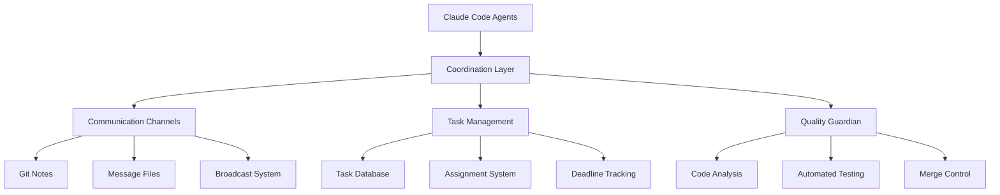
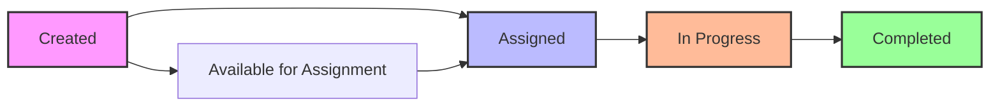

# 📖 Agent Collaboration System - Complete User Guide

A comprehensive guide to using the Claude Code Agent Collaboration System for multi-agent software development.

## 📚 Table of Contents

1. [Quick Start](#-quick-start)
2. [System Overview](#-system-overview)
3. [Installation & Setup](#-installation--setup)
4. [Agent Communication](#-agent-communication)
5. [Task Management](#-task-management)
6. [Testing Guardian](#-testing-guardian)
7. [Skills Reference](#-skills-reference)
8. [Command Reference](#-command-reference)
9. [Best Practices](#-best-practices)
10. [Troubleshooting](#-troubleshooting)
11. [Advanced Usage](#-advanced-usage)

---

## 🚀 Quick Start

### **For New Projects**
```bash
# Create a new collaborative repository
/create-agent-collab-repo my-project node github-username

# Activate coordination
cd my-project
source .claude/agent-coordination-helpers.sh
claude-agents-status
```

### **For Existing Projects**
```bash
# Add collaboration to existing repo
cd existing-project
/add-agent-collab-to-existing

# Start collaborating
source .claude/agent-coordination-helpers.sh
claude-agents-broadcast "Ready to collaborate!"
```

### **Activate Quality Guardian**
```bash
# Set up automated testing and quality control
/agent-tester-guardian . strict false verbose
guardian-start
```

---

## 🏗️ System Overview

### **Architecture Components**



### **Core Features**

| Feature | Description | Benefits |
|---------|-------------|----------|
| **Real-time Coordination** | Git-based event logging and communication | Zero conflicts, seamless collaboration |
| **Intelligent Task Management** | Assignment, deadlines, progress tracking | Organized workflow, clear responsibilities |
| **Automated Quality Assurance** | Comprehensive testing and code validation | Consistent quality, early issue detection |
| **Multi-language Support** | Node.js, Python, Go, Rust testing | Flexible development environment |
| **Cross-shell Compatibility** | Bash, Zsh, Fish support | Works in any development environment |

---

## 💻 Installation & Setup

### **Prerequisites**
- Git repository (existing or new)
- Claude Code installed and configured
- Internet connection (for downloading coordination system)
- Basic shell environment (bash/zsh/fish)

### **Method 1: New Project Setup**

```bash
# 1. Create new collaborative project
/create-agent-collab-repo project-name [project-type] [github-user]

# Project types: generic, node, python, go, docs, config
/create-agent-collab-repo my-api node alice

# 2. Navigate and activate
cd my-api
source .claude/agent-coordination-helpers.sh

# 3. Verify setup
claude-agents-status
```

### **Method 2: Existing Project Setup**

```bash
# 1. Navigate to existing project
cd existing-project

# 2. Add collaboration system
/add-agent-collab-to-existing [repo-path] [agent-name] [analyze-depth] [setup-tasks]

# Example with custom settings
/add-agent-collab-to-existing . my-agent deep true

# 3. Activate coordination
source .claude/agent-coordination-helpers.sh

# 4. Announce joining
claude-agents-broadcast "New agent joining the project!"
```

### **Method 3: Testing Guardian Setup**

```bash
# 1. Ensure coordination is active
source .claude/agent-coordination-helpers.sh

# 2. Install testing guardian
/agent-tester-guardian [repo-path] [strictness] [auto-merge] [notifications]

# Example: strict testing, manual merge, verbose notifications
/agent-tester-guardian . strict false verbose

# 3. Start monitoring
guardian-start

# 4. Verify guardian is active
guardian-status
```

### **Configuration Files Created**

After installation, your project will have:

```
.claude/
├── settings.json                    # Claude Code configuration
├── agent-coordination-helpers.sh    # Bash/Zsh commands
├── agent-coordination-helpers.fish  # Fish shell commands
├── agent-helpers.sh                 # Advanced agent functions
├── COORDINATION.md                  # Documentation
├── tasks/
│   └── task-db.json                # Task management database
├── agents/                         # Agent status tracking
├── communication/                  # Inter-agent messages
└── testing/                        # Guardian infrastructure
    ├── test-guardian.json          # Testing database
    ├── reports/                    # Test reports
    ├── guardian-monitor.sh         # Monitoring scripts
    └── guardian-commands.sh        # Control commands
```

---

## 💬 Agent Communication

### **Communication Channels**

#### **1. Broadcast Messages (Public)**
```bash
# Send message to all active agents
claude-agents-broadcast "Starting work on authentication module"

# Use for:
# - Work status updates
# - General announcements
# - Milestone notifications
# - Team coordination updates
```

#### **2. Direct Messages (Private)**
```bash
# Send private message to specific agent
claude-agents-dm claude-alice-laptop "Can you review the database schema?"
claude-agents-dm testing-guardian "Please prioritize testing this commit"

# Use for:
# - Specific coordination requests
# - Private feedback or questions
# - Targeted status updates
# - Guardian communication
```

#### **3. Automatic Event Logging**
```bash
# System automatically logs:
# - Session start/stop events
# - File modification tracking
# - Commit and push activities
# - Task creation/completion
# - Guardian analysis results

# View automatic logs:
claude-agents-log        # Recent activity
git notes --ref=agent-coordination show HEAD    # Git notes
```

### **Communication Best Practices**

#### **🎯 When to Broadcast**
- Starting work on a new feature/module
- Completing major milestones
- Encountering blockers that affect others
- Sharing important discoveries or decisions

#### **📤 When to Direct Message**
- Requesting specific help or review
- Coordinating integration points
- Asking questions about someone's code
- Providing targeted feedback

#### **👀 Monitoring Communication**
```bash
# View recent messages
claude-agents-messages 10

# Real-time monitoring (live updates)
claude-agents-monitor

# Search communication history
claude-agents-search "authentication"
```

---

## 📋 Task Management

### **Task Lifecycle**



### **Task Commands**

#### **View Tasks**
```bash
# List all tasks
claude-agents-tasks

# View specific task details
claude-agents-task-detail task-001

# Check task status
claude-agents-status  # Includes task overview
```

#### **Task Assignment**
```bash
# Assign task to yourself with deadline
claude-agents-assign task-001 "2026-05-10T17:00:00Z"

# View available tasks
claude-agents-assign  # Shows available tasks if no parameters

# Check your assigned tasks
claude-agents-my-tasks
```

#### **Task Updates**
```bash
# Tasks are automatically updated by Claude Code when you:
# - Create tasks with TaskCreate tool
# - Complete tasks with TaskUpdate tool
# - Modify task status or descriptions

# Manual task operations (if needed):
echo '{"id":"task-001","status":"completed","notes":"Finished authentication"}' | \
  jq '.' >> .claude/tasks/manual-updates.json
```

### **Task Coordination Patterns**

#### **🎯 Project Planning**
```bash
# 1. Lead agent creates initial tasks
# Tasks automatically logged in coordination system

# 2. Team reviews and assigns tasks
claude-agents-broadcast "Task planning complete. Please review and assign tasks."
claude-agents-assign task-001 "2026-05-10T17:00:00Z"

# 3. Coordinate dependencies
claude-agents-dm claude-bob-server "Task-002 depends on my auth work. I'll ping when ready."
```

#### **⚡ Progress Updates**
```bash
# Regular progress broadcasts
claude-agents-broadcast "50% complete on authentication module. ETA 2 hours."

# Coordinate blockers
claude-agents-broadcast "Blocked on API design. Need team input before proceeding."

# Share completion
claude-agents-broadcast "Authentication module complete! Ready for integration."
```

---

## 🛡️ Testing Guardian

### **Guardian Capabilities**

| Feature | Description | Languages Supported |
|---------|-------------|-------------------|
| **Automated Testing** | Runs test suites on every commit | Node.js, Python, Go, Rust |
| **Code Analysis** | Validates code quality and patterns | All languages |
| **Repository Relevance** | Ensures changes fit project purpose | Language-agnostic |
| **Quality Scoring** | Objective 0-100 quality assessment | All languages |
| **Merge Decisions** | APPROVE/CONDITIONAL/REJECT recommendations | All languages |

### **Guardian Commands**

#### **Control Commands**
```bash
# Start/stop guardian
guardian-start          # Begin monitoring
guardian-stop           # Stop monitoring
guardian-status         # Current status

# Manual testing
guardian-test HEAD      # Test specific commit
guardian-test           # Test latest commit

# View results
guardian-results 10     # Recent results
guardian-logs           # Detailed logs
```

#### **Configuration**
```bash
# Guardian settings (in .claude/testing/test-guardian.json):
{
  "guardian_info": {
    "test_strictness": "strict|standard|lenient",
    "auto_merge": true|false,
    "notification_level": "minimal|standard|verbose"
  }
}

# Modify settings
jq '.guardian_info.test_strictness = "strict"' .claude/testing/test-guardian.json > tmp.json && mv tmp.json .claude/testing/test-guardian.json
```

### **Guardian Workflow**

#### **Automatic Process**
1. **Commit Detection** - Guardian detects new commits automatically
2. **Change Analysis** - Analyzes modified files and impact
3. **Relevance Check** - Validates changes fit repository purpose
4. **Testing Execution** - Runs comprehensive test suites
5. **Quality Assessment** - Generates objective quality scores
6. **Merge Decision** - Recommends approve/conditional/reject
7. **Team Notification** - Broadcasts results to all agents

#### **Quality Criteria**
```bash
# Guardian evaluates based on:
✅ Functionality (40 points): Do tests pass?
✅ Relevance (20 points): Does it fit the repository?
✅ Code Quality (20 points): Is it well-structured?
✅ Testing (15 points): Are adequate tests included?
✅ Documentation (5 points): Is it properly documented?

# Scoring thresholds:
# 90-100: Excellent - Auto-approve
# 70-89:  Good - Approve with minor notes
# 50-69:  Conditional - Address issues before merge
# 0-49:   Poor - Reject until significant improvements
```

### **Guardian Integration**

#### **With Task Management**
```bash
# Guardian automatically:
# - Links test results to task completion
# - Notifies task assignees of test results
# - Updates task status based on code quality
# - Provides feedback for improvement

# Manual integration
claude-agents-dm testing-guardian "Please prioritize testing task-001 commits"
```

#### **With Team Communication**
```bash
# Guardian sends automatic broadcasts:
📢 "🛡️ Guardian: Commit a1b2c3d4 analysis complete - APPROVE (92/100)"
📢 "⚠️ Guardian: Conditional approval for b2c3d4e5 - add test coverage"
📢 "❌ Guardian: Rejected c3d4e5f6 - fails relevance check"

# Team responds to guardian feedback:
claude-agents-dm testing-guardian "Added comprehensive tests as requested"
```

---

## 🛠️ Skills Reference

### **Available Skills**

#### **1. create-agent-collab-repo**
Creates new repositories with collaboration built-in.

```bash
# Usage
/create-agent-collab-repo project-name [project-type] [github-user]

# Examples
/create-agent-collab-repo my-api node alice
/create-agent-collab-repo data-analysis python
/create-agent-collab-repo docs-site docs bob

# Project types: generic, node, python, go, docs, config
```

#### **2. add-agent-collab-to-existing**
Adds collaboration to existing repositories.

```bash
# Usage
/add-agent-collab-to-existing [repo-path] [agent-name] [analyze-depth] [setup-tasks]

# Examples
/add-agent-collab-to-existing . alice standard true
/add-agent-collab-to-existing /path/to/repo bob deep true

# Parameters:
# - repo-path: Repository location (default: current directory)
# - agent-name: Your agent identifier (default: system-generated)
# - analyze-depth: quick|standard|deep (default: standard)
# - setup-tasks: true|false (default: true)
```

#### **3. agent-tester-guardian**
Activates intelligent testing and quality assurance.

```bash
# Usage
/agent-tester-guardian [repo-path] [test-strictness] [auto-merge] [notification-level]

# Examples
/agent-tester-guardian . strict false verbose
/agent-tester-guardian /project lenient true minimal

# Parameters:
# - test-strictness: strict|standard|lenient (default: standard)
# - auto-merge: true|false (default: false)
# - notification-level: minimal|standard|verbose (default: standard)
```

### **Skill Integration**

```bash
# Skills work together:
# 1. create-agent-collab-repo creates foundation
# 2. add-agent-collab-to-existing adds collaboration
# 3. agent-tester-guardian adds quality assurance

# Complete setup sequence:
/create-agent-collab-repo my-project node
cd my-project
/agent-tester-guardian . strict false verbose
guardian-start
```

---

## 📚 Command Reference

### **Core Coordination Commands**

| Command | Purpose | Usage Example |
|---------|---------|---------------|
| `claude-agents-status` | Team and project overview | `claude-agents-status` |
| `claude-agents-log` | Recent coordination events | `claude-agents-log` |
| `claude-agents-active` | Currently active agents | `claude-agents-active` |
| `claude-agents-search` | Search coordination history | `claude-agents-search "auth"` |
| `claude-agents-stats` | Detailed statistics | `claude-agents-stats` |

### **Communication Commands**

| Command | Purpose | Usage Example |
|---------|---------|---------------|
| `claude-agents-broadcast` | Send message to all agents | `claude-agents-broadcast "Starting new feature"` |
| `claude-agents-dm` | Send direct message | `claude-agents-dm alice "Need help with tests"` |
| `claude-agents-messages` | View recent messages | `claude-agents-messages 10` |
| `claude-agents-monitor` | Real-time activity monitoring | `claude-agents-monitor` |

### **Task Management Commands**

| Command | Purpose | Usage Example |
|---------|---------|---------------|
| `claude-agents-tasks` | List all tasks | `claude-agents-tasks` |
| `claude-agents-assign` | Assign task with deadline | `claude-agents-assign task-001 "2026-05-10T17:00:00Z"` |
| `claude-agents-my-tasks` | View your assigned tasks | `claude-agents-my-tasks` |

### **Guardian Commands**

| Command | Purpose | Usage Example |
|---------|---------|---------------|
| `guardian-start` | Start testing monitoring | `guardian-start` |
| `guardian-stop` | Stop guardian | `guardian-stop` |
| `guardian-status` | Guardian status and stats | `guardian-status` |
| `guardian-test` | Manual test trigger | `guardian-test HEAD` |
| `guardian-results` | View recent test results | `guardian-results 5` |

### **Analysis Commands**

| Command | Purpose | Usage Example |
|---------|---------|---------------|
| `claude-agents-analyze` | Project analysis and info | `claude-agents-analyze` |
| `claude-agents-cleanup` | Clean old coordination data | `claude-agents-cleanup` |

---

## 🎯 Best Practices

### **🚀 Getting Started**

#### **For Project Leaders**
```bash
# 1. Set up coordination foundation
/create-agent-collab-repo project-name project-type github-user

# 2. Activate quality guardian
/agent-tester-guardian . strict false verbose
guardian-start

# 3. Create initial tasks and communicate plan
claude-agents-broadcast "Project initialized! Check tasks and assign yourselves."

# 4. Establish team communication norms
claude-agents-broadcast "Communication protocol: Broadcast work status, DM for specific coordination."
```

#### **For Team Members**
```bash
# 1. Join existing project
git clone project-repo
cd project-repo
/add-agent-collab-to-existing

# 2. Introduce yourself
source .claude/agent-coordination-helpers.sh
claude-agents-broadcast "Agent [name] joining the project! Ready to collaborate."

# 3. Check current status
claude-agents-status
claude-agents-tasks

# 4. Assign yourself appropriate tasks
claude-agents-assign task-xxx "YYYY-MM-DDTHH:MM:SSZ"
```

### **💬 Communication Guidelines**

#### **Effective Broadcasting**
```bash
# ✅ Good broadcasts:
claude-agents-broadcast "Starting authentication module - ETA 3 hours"
claude-agents-broadcast "Database schema complete - ready for integration"
claude-agents-broadcast "Blocked on API design - need team input"
claude-agents-broadcast "Feature complete - tests passing - ready for review"

# ❌ Avoid:
claude-agents-broadcast "Working on stuff"
claude-agents-broadcast "Almost done"
claude-agents-broadcast "Having issues"
```

#### **Direct Message Best Practices**
```bash
# ✅ Effective direct messages:
claude-agents-dm alice "Your auth module looks great! Can you add rate limiting to login endpoint?"
claude-agents-dm bob "I'm integrating with your user model. Can we sync on the schema changes?"
claude-agents-dm testing-guardian "Please prioritize testing commit abc123 - critical fix"

# ✅ Coordination requests:
claude-agents-dm alice "I need to modify database.js - are you currently working on it?"
claude-agents-dm bob "Ready to merge auth changes - can you test the integration?"
```

### **📋 Task Management Best Practices**

#### **Task Assignment Strategy**
```bash
# 1. Assign tasks with realistic deadlines
claude-agents-assign task-001 "2026-05-10T17:00:00Z"  # Specific datetime

# 2. Coordinate dependencies
claude-agents-dm alice "Task-002 depends on your auth work - I'll wait for your completion signal"

# 3. Update team on progress
claude-agents-broadcast "Task-001 50% complete - authentication middleware done, testing remaining"

# 4. Signal completion clearly
claude-agents-broadcast "Task-001 complete! Authentication module ready for integration."
```

### **🛡️ Working with Guardian**

#### **Responding to Guardian Feedback**
```bash
# When guardian provides conditional approval:

# 1. Acknowledge feedback
claude-agents-dm testing-guardian "Thanks for the detailed analysis! Addressing test coverage now."

# 2. Implement improvements
# Add tests, fix issues, improve code quality

# 3. Signal completion
claude-agents-dm testing-guardian "Added comprehensive tests as requested - ready for re-analysis"

# 4. Wait for re-analysis
# Guardian automatically re-tests improved commits
```

#### **Guardian Communication Patterns**
```bash
# Guardian automatically broadcasts:
📢 "🛡️ Guardian: Commit a1b2c3d4 analysis complete - APPROVE (92/100)"
📢 "⚠️ Guardian: Conditional approval for b2c3d4e5 - add test coverage"

# Team can communicate with guardian:
claude-agents-dm testing-guardian "Please analyze commit xyz123 with high priority"
claude-agents-dm testing-guardian "The failing test is a known issue - please approve override"
```

### **🔄 Workflow Patterns**

#### **Feature Development Workflow**
```bash
# 1. Announce work start
claude-agents-broadcast "Starting feature X - will touch files A, B, C"

# 2. Coordinate with affected parties
claude-agents-dm bob "I'm modifying user.js - let me know when you're done with your changes"

# 3. Implement with regular updates
claude-agents-broadcast "Feature X 25% complete - authentication logic done"
claude-agents-broadcast "Feature X 75% complete - adding tests now"

# 4. Handle guardian feedback
# Respond to test results and quality feedback

# 5. Signal completion
claude-agents-broadcast "Feature X complete - all tests passing - ready for integration"
```

#### **Integration Coordination**
```bash
# 1. Signal readiness
claude-agents-broadcast "Module A ready for integration - API stable"

# 2. Coordinate integration
claude-agents-dm alice "Your module A looks great! Integrating with module B now"

# 3. Test integration
# Let guardian automatically test integration commits

# 4. Confirm integration
claude-agents-broadcast "Modules A+B integration complete - all tests green"
```

---

## 🔧 Troubleshooting

### **Common Issues & Solutions**

#### **🚨 Agent Not Appearing in Status**

**Problem**: Your agent doesn't show up in `claude-agents-active`

**Diagnosis**:
```bash
# Check if coordination is loaded
which claude-agents-status
# Should show function definition

# Check if agent helpers are sourced
echo $CLAUDE_AGENT_ID
# Should show your agent ID
```

**Solutions**:
```bash
# 1. Source coordination helpers
source .claude/agent-coordination-helpers.sh

# 2. Verify git repository
git status
# Must be in a git repository

# 3. Check coordination system installation
ls -la .claude/
# Should see coordination files

# 4. Reinstall if needed
/add-agent-collab-to-existing . your-agent-name
```

#### **📢 Messages Not Broadcasting**

**Problem**: `claude-agents-broadcast` doesn't seem to work

**Diagnosis**:
```bash
# Check function availability
type claude-agents-broadcast
# Should show function definition

# Check task database
ls -la .claude/tasks/task-db.json
# Should exist and be writable

# Check git notes capability
git notes --ref=agent-coordination show HEAD
# Should show recent notes or create new ones
```

**Solutions**:
```bash
# 1. Ensure database exists
mkdir -p .claude/tasks .claude/agents .claude/communication
echo '{"tasks":[],"agents":{},"communication_log":[]}' > .claude/tasks/task-db.json

# 2. Test git notes
git notes --ref=agent-coordination add -m "test note" HEAD

# 3. Check permissions
chmod +w .claude/tasks/task-db.json

# 4. Reload coordination system
source .claude/agent-coordination-helpers.sh
```

#### **🛡️ Guardian Not Starting**

**Problem**: `guardian-start` fails or guardian doesn't monitor

**Diagnosis**:
```bash
# Check guardian installation
ls -la .claude/testing/
# Should contain guardian files

# Check guardian status
cat .claude/testing/guardian-status.txt
# Should exist

# Check testing database
cat .claude/testing/test-guardian.json
# Should be valid JSON
```

**Solutions**:
```bash
# 1. Reinstall guardian
/agent-tester-guardian . standard false standard

# 2. Check dependencies
which jq npm python3 go  # Check available tools

# 3. Manual guardian setup
mkdir -p .claude/testing/{reports,queue,results}
echo '{"guardian_info":{"activated_at":"'$(date -Iseconds)'"},"test_queue":[],"test_results":[]}' > .claude/testing/test-guardian.json

# 4. Restart guardian
guardian-stop
guardian-start
```

#### **📂 File Coordination Issues**

**Problem**: File locks not working or conflicts occurring

**Diagnosis**:
```bash
# Check file lock directory
ls -la .claude/locks/
# Should show active locks

# Check file modification logs
git notes --ref=agent-coordination show HEAD | grep FILE_MODIFY
# Should show recent file activity
```

**Solutions**:
```bash
# 1. Clean stale locks
rm -rf .claude/locks/*.lock

# 2. Check hook configuration
cat .claude/settings.json | jq '.hooks'
# Should show file coordination hooks

# 3. Test file coordination
echo "test" > test-file.txt
# Should trigger file modification logs

# 4. Reload hooks
# Restart Claude Code session to reload hooks
```

#### **🔍 Task Management Problems**

**Problem**: Tasks not showing or assignment failing

**Diagnosis**:
```bash
# Check task database
cat .claude/tasks/task-db.json | jq '.tasks'
# Should show task list

# Check task assignment function
type claude-agents-assign
# Should show function definition
```

**Solutions**:
```bash
# 1. Initialize task database
mkdir -p .claude/tasks
echo '{"tasks":[],"agents":{},"project_info":{},"communication_log":[]}' > .claude/tasks/task-db.json

# 2. Check jq availability
which jq || echo "jq not installed - install with: apt-get install jq (Linux) or brew install jq (macOS)"

# 3. Manual task creation
# Use Claude Code TaskCreate tool to create tasks

# 4. Reload coordination
source .claude/agent-coordination-helpers.sh
```

### **🩺 Health Check Script**

Create a comprehensive health check:

```bash
#!/bin/bash
# Agent Collaboration Health Check

echo "🔍 Agent Collaboration Health Check"
echo "=================================="

# Check git repository
if [ -d .git ]; then
    echo "✅ Git repository detected"
else
    echo "❌ Not in a git repository"
    exit 1
fi

# Check coordination files
if [ -f .claude/settings.json ]; then
    echo "✅ Coordination settings found"
else
    echo "❌ Coordination settings missing - run setup skill"
fi

# Check helper functions
if [ -f .claude/agent-coordination-helpers.sh ]; then
    source .claude/agent-coordination-helpers.sh
    if type claude-agents-status >/dev/null 2>&1; then
        echo "✅ Helper functions loaded"
    else
        echo "❌ Helper functions not working"
    fi
else
    echo "❌ Helper functions missing"
fi

# Check task database
if [ -f .claude/tasks/task-db.json ]; then
    if jq empty .claude/tasks/task-db.json 2>/dev/null; then
        echo "✅ Task database valid"
    else
        echo "❌ Task database corrupted"
    fi
else
    echo "❌ Task database missing"
fi

# Check guardian
if [ -f .claude/testing/test-guardian.json ]; then
    echo "✅ Guardian installed"
    if [ -f .claude/testing/guardian-status.txt ]; then
        echo "✅ Guardian active"
    else
        echo "⚠️  Guardian inactive - run guardian-start"
    fi
else
    echo "⚠️  Guardian not installed - run guardian skill"
fi

# Check dependencies
for cmd in jq git; do
    if command -v $cmd >/dev/null 2>&1; then
        echo "✅ $cmd available"
    else
        echo "❌ $cmd missing - please install"
    fi
done

echo ""
echo "🎉 Health check complete!"
```

---

## 🚀 Advanced Usage

### **🔧 Customization**

#### **Custom Agent ID**
```bash
# Set custom agent identifier
export CLAUDE_AGENT_ID="claude-alice-frontend-dev"

# Make permanent in shell profile
echo 'export CLAUDE_AGENT_ID="claude-alice-frontend-dev"' >> ~/.bashrc
```

#### **Custom Guardian Settings**
```bash
# Modify guardian behavior
jq '.guardian_info.test_strictness = "lenient"' .claude/testing/test-guardian.json > tmp.json && mv tmp.json .claude/testing/test-guardian.json

# Enable auto-merge for trusted commits
jq '.guardian_info.auto_merge = true' .claude/testing/test-guardian.json > tmp.json && mv tmp.json .claude/testing/test-guardian.json

# Adjust notification verbosity
jq '.guardian_info.notification_level = "minimal"' .claude/testing/test-guardian.json > tmp.json && mv tmp.json .claude/testing/test-guardian.json
```

#### **Custom Communication Patterns**
```bash
# Create custom broadcast functions
alias announce-feature="claude-agents-broadcast 'New feature ready for review:'"
alias request-help="claude-agents-broadcast 'Need assistance with:'"
alias share-blocker="claude-agents-broadcast 'Blocked on:'"

# Custom direct message templates
dm-code-review() {
    local agent="$1"
    local file="$2"
    claude-agents-dm "$agent" "Could you review $file when you have a moment? Thanks!"
}

dm-integration-ready() {
    local agent="$1"
    local module="$2"
    claude-agents-dm "$agent" "Module $module is ready for integration. API is stable."
}
```

### **📊 Analytics & Reporting**

#### **Custom Analytics Functions**
```bash
# Agent productivity analysis
analyze-agent-productivity() {
    local agent="$1"
    local since="${2:-1 week ago}"

    echo "📊 Productivity Analysis for $agent since $since"
    echo "================================================"

    # Commits by agent
    git log --since="$since" --author="$agent" --oneline | wc -l | xargs echo "Commits:"

    # Lines added/removed
    git log --since="$since" --author="$agent" --stat | grep -E "insertions|deletions" | tail -1

    # Files modified
    git log --since="$since" --author="$agent" --name-only --pretty=format: | sort -u | grep -v "^$" | wc -l | xargs echo "Files modified:"

    # Tasks completed (from coordination logs)
    git log --since="$since" --grep="TASK_COMPLETED.*$agent" --oneline | wc -l | xargs echo "Tasks completed:"
}

# Team coordination effectiveness
analyze-team-coordination() {
    echo "🤝 Team Coordination Analysis"
    echo "============================"

    # Active agents
    jq -r '.agents | to_entries[] | select(.value.status == "active") | .key' .claude/tasks/task-db.json | wc -l | xargs echo "Active agents:"

    # Communication frequency
    jq '.communication_log | length' .claude/tasks/task-db.json | xargs echo "Total communications:"

    # Task completion rate
    local total_tasks=$(jq '.tasks | length' .claude/tasks/task-db.json)
    local completed_tasks=$(jq '.tasks | map(select(.status == "completed")) | length' .claude/tasks/task-db.json)
    echo "Task completion rate: $completed_tasks/$total_tasks ($(echo "scale=1; $completed_tasks * 100 / $total_tasks" | bc)%)"

    # Guardian approval rate
    if [ -f .claude/testing/test-guardian.json ]; then
        local total_tests=$(jq '.test_results | length' .claude/testing/test-guardian.json)
        local approved_tests=$(jq '.test_results | map(select(.feedback.recommendation == "approve")) | length' .claude/testing/test-guardian.json)
        echo "Guardian approval rate: $approved_tests/$total_tests ($(echo "scale=1; $approved_tests * 100 / $total_tests" | bc)%)"
    fi
}

# Quality trend analysis
analyze-quality-trends() {
    echo "📈 Code Quality Trends"
    echo "====================="

    if [ -f .claude/testing/test-guardian.json ]; then
        # Average quality score
        jq -r '.test_results[].feedback.score' .claude/testing/test-guardian.json | awk '{sum+=$1; count++} END {print "Average quality score:", sum/count}'

        # Quality trend (last 10 commits)
        echo "Recent quality scores:"
        jq -r '.test_results[-10:] | .[] | "\(.commit_hash[0:8]): \(.feedback.score)/100 (\(.feedback.recommendation))"' .claude/testing/test-guardian.json
    else
        echo "Guardian not installed - no quality data available"
    fi
}
```

### **🔗 Integration with External Tools**

#### **CI/CD Integration**
```bash
# GitHub Actions integration
cat > .github/workflows/agent-coordination.yml << 'EOF'
name: Agent Coordination Check
on: [push, pull_request]

jobs:
  coordination-check:
    runs-on: ubuntu-latest
    steps:
      - uses: actions/checkout@v3
        with:
          fetch-depth: 0  # Full history for coordination analysis

      - name: Install dependencies
        run: |
          sudo apt-get update
          sudo apt-get install -y jq

      - name: Source coordination helpers
        run: |
          if [ -f .claude/agent-coordination-helpers.sh ]; then
            source .claude/agent-coordination-helpers.sh
            echo "Agent coordination system detected"
          fi

      - name: Run coordination analysis
        run: |
          if [ -f .claude/testing/test-guardian.json ]; then
            echo "Guardian analysis results:"
            jq -r '.test_results[-5:] | .[] | "Commit \(.commit_hash[0:8]): \(.feedback.recommendation) (\(.feedback.score)/100)"' .claude/testing/test-guardian.json
          fi

      - name: Check recent agent activity
        run: |
          echo "Recent coordination events:"
          git log --grep="AGENT_EVENT:" --oneline -10 || echo "No agent events found"
EOF
```

#### **Slack/Discord Integration**
```bash
# Webhook integration for team notifications
post-to-slack() {
    local message="$1"
    local webhook_url="$SLACK_WEBHOOK_URL"  # Set this environment variable

    if [ -n "$webhook_url" ]; then
        curl -X POST -H 'Content-type: application/json' \
             --data "{\"text\":\"🤖 Agent Coordination: $message\"}" \
             "$webhook_url"
    fi
}

# Enhanced broadcast that also posts to Slack
claude-agents-broadcast-enhanced() {
    local message="$1"

    # Normal broadcast
    claude-agents-broadcast "$message"

    # Also post to Slack if configured
    post-to-slack "$message"
}

# Guardian results to Slack
guardian-notify-slack() {
    if [ -f .claude/testing/test-guardian.json ]; then
        local latest_result=$(jq -r '.test_results[-1] | "Commit \(.commit_hash[0:8]): \(.feedback.recommendation) (\(.feedback.score)/100)"' .claude/testing/test-guardian.json)
        post-to-slack "Guardian Analysis: $latest_result"
    fi
}
```

### **🎛️ Advanced Configuration**

#### **Multi-Repository Coordination**
```bash
# Coordinate across multiple repositories
setup-multi-repo-coordination() {
    local repos=("$@")

    for repo in "${repos[@]}"; do
        if [ -d "$repo" ]; then
            echo "Setting up coordination in $repo"
            (cd "$repo" && /add-agent-collab-to-existing)
        fi
    done

    # Create workspace configuration
    cat > .agent-workspace.json << EOF
{
  "workspace_name": "multi-repo-coordination",
  "repositories": [$(printf '"%s",' "${repos[@]}" | sed 's/,$//')]
  "coordination_mode": "shared"
}
EOF
}

# Cross-repo status check
check-workspace-status() {
    if [ -f .agent-workspace.json ]; then
        local repos=$(jq -r '.repositories[]' .agent-workspace.json)

        for repo in $repos; do
            if [ -d "$repo" ]; then
                echo "🔍 Status for $repo:"
                (cd "$repo" && claude-agents-status 2>/dev/null || echo "  No coordination active")
                echo ""
            fi
        done
    fi
}
```

This comprehensive guide provides everything needed to effectively use the Agent Collaboration System for multi-agent software development! 🚀

---

*For additional help, refer to the [Full Lifecycle Demo](FULL_LIFECYCLE_DEMO.md) for practical examples, or check the [troubleshooting section](#-troubleshooting) for common issues.*